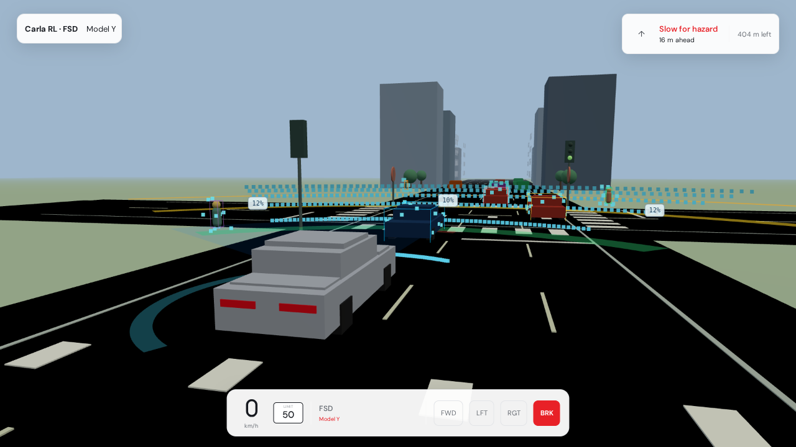

# Highway RL

**Train a driving policy in highway-env on your laptop, then ask it for throttle, brake, and steering over HTTP.**

The repository is still named `Carla_RL`. The thing you can run without bringing your own simulator is [highway-env](https://github.com/Farama-Foundation/HighwayEnv): a small Gymnasium driving task, a DQN (optional Double DQN and dueling heads), and a training script. Next to it is a FastAPI service that loads a versioned TorchScript policy, checks the request, and returns bounded controls.

CARLA is optional. It needs a simulator you install yourself. It is not the path this page starts with.

## Why try it

A lot of driving-RL repos end at a checkpoint on disk. The awkward next step is letting another program call that policy without importing the training stack. This repo is built around that step.

The service treats a policy as a versioned directory: a model card, the preprocessor that was fit with it, and SHA-256 hashes checked at load. A request can ask for deterministic inference. Health, version, git revision, and Prometheus metrics are part of the process, and the version tools can discover, select, and roll back artifacts.

Two limits, up front, so the rest of the page stays useful:

- **No driving or training result is published here.** No reward table, no success rate, no episode counts from a retained run, no trained weights. Checkpoints and logs are gitignored. If you want a number, you have to train and measure it.
- **The two halves are not wired together yet.** Training writes Keras models. The service loads TorchScript. There is no tested converter in the tree.

## What you are not looking at

Easy to misread, and not results:

- `scripts/create_example_artifacts` builds a network so the server has something to load. It is not trained. Construction uses PyTorch's default initializer with no seed, then multiplies the last layer's weights by 0.1 and sets that layer's bias to `[0.5, -2.0, 0.0]`. The file `model.pt` hashes differently every time you generate it.
- The chase-cam in [`model-sim/demos/web/`](model-sim/demos/web) is a rule-based controller (`source: "sensor-feedback"` in `ego-controller.ts`). It does not load a policy. The OpenCV playback in `demos/fsd_playback.py` uses `LocalDrivingPolicy`, which is also rule-based.
- [`AUDIT_version-updates-verify.md`](AUDIT_version-updates-verify.md) records one dependency-upgrade load test of the HTTP service on the author's machine, against an untrained example artifact. Those figures are latency and throughput, not driving quality, and they are not a benchmark this README repeats.

## Contents

- [Getting started](#getting-started)
- [Worked example](#worked-example)
- [Demo](#demo)
- [CARLA, optional](#carla-optional)
- [Contributing](#contributing)
- [License](#license)

## Getting started

Python **3.12 or 3.13**, and [uv](https://docs.astral.sh/uv/). Each component has its own lockfile. There is no install at the repository root.

| If you want | You supply |
| --- | --- |
| A policy that has actually learned to drive | Your own training run. No weights are committed. |
| CARLA playback | A CARLA 0.9.15 server and the matching Python API |
| The browser chase-cam | Node.js, npm, and a WebGL browser |

### Highway, the path that runs here

```bash
git clone https://github.com/T-Py-T/Carla_RL.git
cd Carla_RL/model-sim
uv sync --locked --extra apple-gpu --extra dev
```

`apple-gpu` is a historical extra name. It installs the plain CPU TensorFlow wheel, which is what you want on macOS and on Linux without CUDA. On Linux with an NVIDIA GPU, use `--extra nvidia-gpu` instead (`tensorflow[and-cuda]`).

Train:

```bash
uv run python training/highway/train_highway.py \
  --scenario highway \
  --episodes 1000 \
  --double-dqn \
  --dueling-dqn \
  --no-wandb \
  --no-tensorboard
```

Scenarios: `highway`, `merge`, `intersection`, `parking`, `racetrack`, and `curriculum` (cycles the other five). Drop the last two flags to log to TensorBoard and Weights & Biases. This training command was **not** run while writing this page, so no episode count or return is reported.

What was run, once, from `model-sim` with `src` on `PYTHONPATH`, is a single reset of the wrapped environment:

```text
env_id highway-fast-v0
obs_shape (5, 5) float32
action_space Discrete(5)
```

`HighwayEnvironment` resets inside `__init__` so the observation space matches any config, then this call reset again with `seed=0`. That shape is the default kinematics observation. It is not a score. The `info` dict from that reset includes a `rewards` key; the value is not quoted here because one reset is not a training result.

After a run of your own, models land under `models/highway` (gitignored). JSON sidecars next to them may not be ignored, so check `git status` before you commit. Evaluate with:

```bash
uv run python evaluation/highway/evaluate_models.py
```

That evaluator was not run here. It needs models you trained.

On this checkout, `uv run pytest tests -q` in `model-sim` reported `12 passed, 2 skipped`. The skips are the GPU probe (this Mac has the CPU wheel, so TensorFlow sees no GPU) and the CUDA probe (it only runs on Linux or Windows).

### Serve an untrained policy

Still no GPU, no display, and no trained model. From `model-serving`:

```bash
uv sync --locked --extra dev
uv run python -m scripts.create_example_artifacts \
  --output artifacts \
  --version v0.1.0
ARTIFACT_DIR=artifacts MODEL_VERSION=v0.1.0 \
  uv run uvicorn src.server:app --host 127.0.0.1 --port 8080
```

API docs: `http://127.0.0.1:8080/docs`.

`GET /healthz` stays `degraded` until something has exercised the model. `POST /warmup` flips it to `ok`. Confirmed on this machine against a freshly generated v0.1.0 artifact: `degraded`, then `{"status":"warmed",...}`, then `{"status":"ok",...}`.

On this same checkout, `uv run pytest tests -q --tb=line -m "not slow and not integration"` reported `685 passed, 14 skipped, 2 deselected`. The marker filter left out slow and integration tests. Several skips are integration cases that want a server already listening on port 8080. The unfiltered `pytest tests -q` was not run.

## Worked example

With the server up, the loaded artifact describes itself as a five-wide input. Those five numbers are `speed`, `steering`, and **three** sensor readings. The example preprocessor was fit on three sensors.

```bash
curl -s http://127.0.0.1:8080/metadata
```

```json
{"modelName":"carla-ppo","version":"v0.1.0","device":"cpu","inputShape":[5],"actionSpace":{"throttle":[0.0,1.0],"brake":[0.0,1.0],"steer":[-1.0,1.0]}}
```

```bash
curl -s -X POST http://127.0.0.1:8080/predict \
  -H 'Content-Type: application/json' \
  -d '{
    "observations": [{
      "speed": 25.5,
      "steering": 0.1,
      "sensors": [0.8, 0.2, 0.5]
    }],
    "deterministic": true
  }'
```

One call on this Mac, against one generated artifact, returned:

```json
{"actions":[{"throttle":0.4651787281036377,"brake":0.0,"steer":0.0004096789925824851}],"version":"v0.1.0","timingMs":0.9672089945524931,"deterministic":true}
```

A second identical call returned the same `actions` and a different `timingMs`. That match is the deterministic flag doing its job for a fixed artifact. It is not a driving score, and the next `create_example_artifacts` run will not reproduce those floats, because initialization is unseeded. A request carries 1 to 1,000 observations.

Do not copy the five-sensor example still embedded in [`model-serving/src/io_schemas.py`](model-serving/src/io_schemas.py). Request validation accepts it (sensors only have to be a non-empty list of finite numbers). Inference then fails. On this machine a five-sensor body returned `INFERENCE_ERROR`: the preprocessor emitted 7 features into a linear layer of width 5 (`mat1 and mat2 shapes cannot be multiplied (1x7 and 5x64)`). Use three sensors with the example artifact.

`GET /versions` lists artifact directories and the hashes it checked.

## Demo

There is a Three.js chase-cam under [`model-sim/demos/web/`](model-sim/demos/web). A still already in the tree:



That file is a capture that was committed with the demo. This page does not claim a fresh look at the live browser scene. The car in that demo is steered by the rule-based controller above. No policy weights are loaded.

```bash
cd model-sim/demos/web
npm install
npm run dev
```

`npm install` and `npm run dev` were not run for this rewrite, and the browser scene was not opened.

A headless OpenCV renderer, no browser:

```bash
cd model-sim
uv run python demos/fsd_playback.py --mode offline --headless --steps 240
```

`--mode offline` does not contact CARLA. A shorter run, `--steps 5`, exited 0 on this Mac and printed nothing. No frame was saved, and the output was not inspected visually. The default `--steps 240` was not run. Notes on the capture scripts are in [docs/carla-fsd-playback.md](docs/carla-fsd-playback.md).

## CARLA, optional

[`model-sim/src/carla_rl/env.py`](model-sim/src/carla_rl/env.py) can connect to a CARLA server, load a town, and spawn an ego vehicle with camera and collision sensors. `demos/fsd_playback.py --mode carla` uses that for live ego-camera playback.

None of that was run here. The simulator is not in the repo. You need a CARLA 0.9.15 server, the matching Python API, and in practice Linux with an NVIDIA GPU. [`model-sim/docker/setup_carla.sh`](model-sim/docker/setup_carla.sh) helps fetch the server. Highway training never imports CARLA.

## Layout

| Path | What it is |
| --- | --- |
| [`model-sim/`](model-sim) | highway-env, DQN, trainer, evaluation, demos, tests |
| [`model-serving/`](model-serving) | FastAPI service, versioned artifacts, deploy manifests, tests |
| [`docs/`](docs) | playback notes and captured demo media |
| [`.devcontainer/`](.devcontainer) | containerized dev environment |
| [`Makefile`](Makefile) | shortcuts into both components |

There is no hosted CI. [`.github/workflows/README.md`](.github/workflows/README.md) says why. `make check` at the root runs Ruff and then a bare `python` compile step, which does nothing useful on a machine where only `python3` is on `PATH`. The component pytest commands above are the gate that was actually run.

The Dockerfile, Compose files, Kubernetes manifests, and Prometheus / Grafana config under `model-serving/deploy/` are development references. The Kubernetes example uses `imagePullPolicy: Never`. CORS and allowed hosts default to `*`. Read those before you run any of it outside an isolated environment.

## Contributing

Pull requests target `master`. Keep a change inside the component it touches, run that component's locked tests, and leave checkpoints and generated artifacts out of the commit. The checklist is [`CONTRIBUTING.md`](CONTRIBUTING.md). Vulnerabilities go through [`SECURITY.md`](SECURITY.md), not a public issue.

## License

[Apache License 2.0](LICENSE) for the repository by default. `model-serving` has its own [MIT License](model-serving/LICENSE). Third-party libraries and simulators stay under their own terms.
